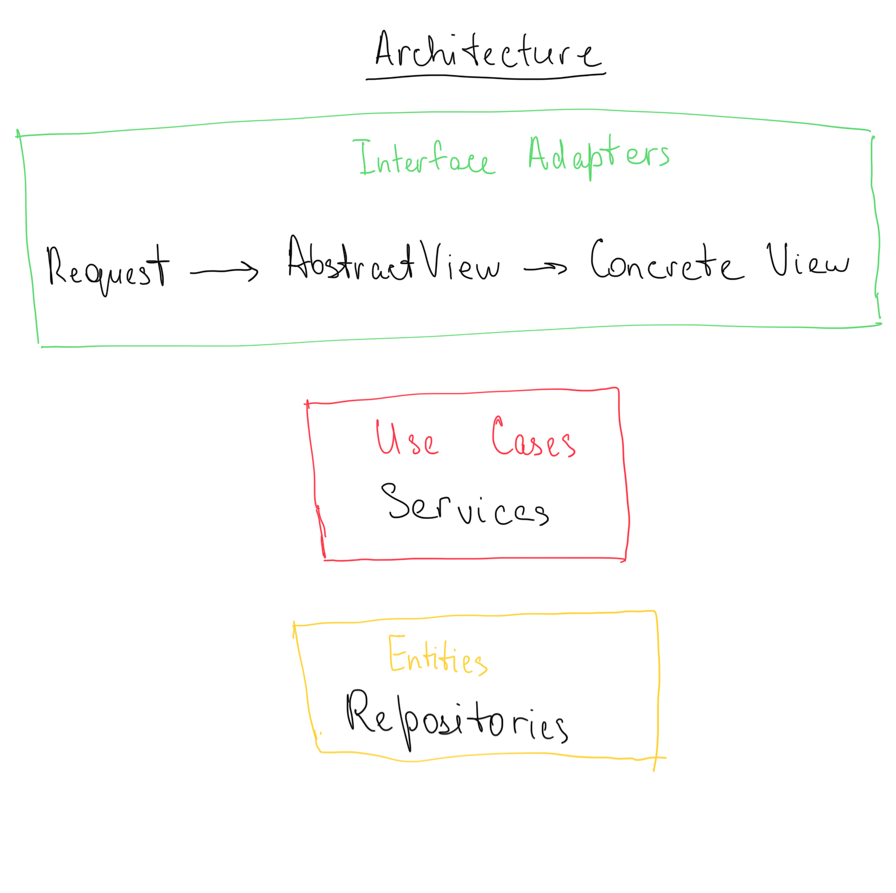

- [API Docs](https://documenter.getpostman.com/view/1604017/RznBLzAk)

## Architecture

The architecture of the app is inspired by [clean architecture](https://blog.cleancoder.com/uncle-bob/2012/08/13/the-clean-architecture.html). The image below explains the inner structure of the app divided into clean architecture's layers.

    

As for the outter structure of the app, Flask framework is used. So it can be considered as the external interface of the app.

## Docker

The app is dockerized and uses [Dockerfile](./Dockerfile) for production builds and [Dockerfile.dev](./Dockerfile.dev) for local development.